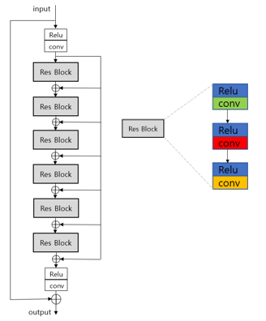

# RRSR
Single Image Super Resolution Reconstruction Based on Recursive Residual Convolutional Neural Network

We refer to the main idea of ResNet and construct a residual block structure with three convolutional layers. First, the image features are extracted by a convolution layer. Then after passing each residual block, we add the feature image extracted from the first convolutional layer. by doing so, we keep the branch inputs of the residuals consistent. More image information is transmitted to the deep network.
The function of the residual network is

H^m=R(H^(m-1) )=F(H^(m-1),W)+H^0,            

where H^m is the output of the m-th residual block, R is the residual block function, F(H^(m-1),W) is the learned residual map, and H^0 is the feature image that is output through the first convolution layer.
We use a recursive structure to control the number of parameters, which means that the weight parameters between the residual blocks are shared. The above function formula can also be written as:

H^m=R^((m) ) (H^0 )=R(R…R(R(H^0 ))…).        

